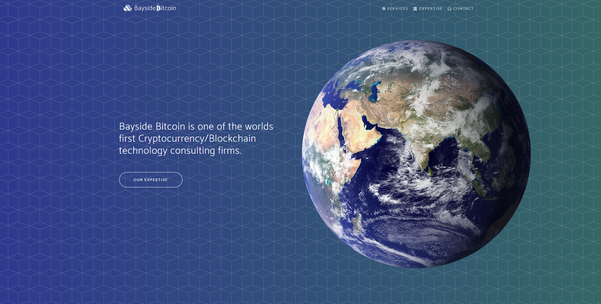

# [bayside-bitcoin-site](https://www.baysidebitcoin.com)
Bayside Bitcoin cryptocurrency and Blockchain consulting company website. Created using the template provided by Blackrock Digital known as New-age.

**[View Live Preview](https://baysidebitcoin.github.io/baysidebitcoin-site/)**

## Technology Used
 - NPM + GULP
 - HTML, CSS, SCSS, Javascript
 - Bootstrap, Jquery, Font-Awesome

## About

Contains information about Bayside Bitcoin's consulting services.

## Status

## Copyright and License
- Copyright 2013-2017 Blackrock Digital LLC. Code released under the [MIT](https://github.com/BlackrockDigital/startbootstrap-new-age/blob/gh-pages/LICENSE) license.
- Copyright 2018 Bayside Bitcoin LLC. Code released under the [MIT](https://github.com/BlackrockDigital/startbootstrap-new-age/blob/gh-pages/LICENSE) license.